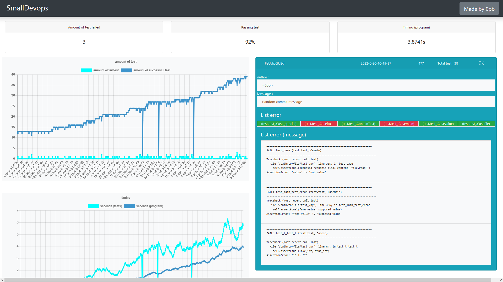

# SmallDevops

Small local/offline continuous developpement for python (currently for unittest only) with no dependency.
It consist in a python module and a webpage.

## **Requirements**

- Linux.
- Unittest and pytest only.
- Python3 (only the module require it, you can still launch your own script in Python2.7 if you wish).
- No server (flask, django etc) is required, the website is a simple html file (work offline and on any local computer without additional setup).

---

## **How to download the project**

`pip install SmallDevops` install the SmallDevops package. You can also directly use this project by cloning it and then using `python -m SmallDevops`.

---

## **How the webpage looks like** 

Commit with 3 failures in test : 


- "Passing test" refers to amount of test failed / total amount of test.
- "Timing (program)" come from the usr/bin/time command available on linux.

Right column 

- top : commit - date - index of commit - total amount of test - button to make the graph full size
- middle : Author and Commit message
- List error : Grid of test case; It refer to name of the test case (when you write `class Test_main(unittest.TestCase):` for example)
- List error (message) : Errors messages

---

## **How it work**

The python module will launch the script you pass as argument. Then it will recover informations like the time it took to run your script, the amount of test found by unittest, last git information, etc. and put it in a dictionnary.

Finally It append this dictionnary containing the informations of the last run inside a javascript file. This javascript file is used by the webpage as a json object to display the graph. 

A javascript file is needed as you cannot load .json file in a local static webpage due to content policy.

## **How to use it**

`git init` in the folder you want (or you may want to use an already existing project).

Then : 

### Basic : 

- `python -m SmallDevops create_website` create "file.html" in the current folder.
- `python -m SmallDevops "python3.6 script.py"` execute "python3.6 script.py" and create a file "output.js" in the current folder.

You can now open file.html in your browser and voila. The page load the output.js file and display data.

Because the script only get the last commit data, the command `python -m SmallDevops "python3.6 script.py"` need to be run every time you commit.

It mean you either need to type the command each time you commit or you can use a post-commit hooks (like this [one](example/post-commit)) to automatically execute the script for every commit.

You can also ignore committing and simply run the script, however you will miss informations.
You cannot use this module without a git project (except if you do your own test class, shown later below). However you can git init, then git commit once and never bother committing again afterward.

### Fully automatic : 

- `python -m SmallDevops create_website /path/where/you/want/the/website` create a "file.html" in the path given as argument.
- create a hook post-commit or post-receive (if you put it on a git server) in your .git/hooks folder with this command : `exec python -m SmallDevops "python script.py" -dir=/path/to/script -output=/path/where/you/want/the/website`

Now every you commit the script will run automatically and update the data accordingly.

### If you want to execute your script in python2.7 :

Add `-template=unittest_timing_git_python27` (ex : `python -m SmallDevops "python2.7 script.py" -template=unittest_timing_git_python27`.

If you want to use another version of python, either change your current python version (which the module detect with sys.version), or create your own test class and change the get_discover_command() function which run unittest.

---

## **How to add your own test class**

Those test class are used by the SmallDevops as a way to get an output from a script, then process that output and put it in a directory.

Here is an example for [unittest](SmallDevops/template_class/unittest_timing_git.py) and here is the [base template](SmallDevops/template_class/base_class_test.py).

The unittest_timing_git test class get the output, then process it trought different function. As an example if you wish to get the user time instead of the real time used by the module, you can copy unittest_timing_git.py, then change the get_execution_time() function like so :

```

def get_execution_time(self, command : list, true_if_print_output : bool) -> float:
    str_command = shlex.split('\\time -f "%E|%U|%S" ') + command
    output_from_execution = execute_command_in_cmd(str_command)[0]
    if true_if_print_output:
        print(output_from_execution)
    timing = str(output_from_execution).split("\n")
        return float(timing[-2].split("|")[1])
                                           ^ Where the change is done
```

Once you do that and save the modified file as my_own_test_class.py, you can either re-build the package, or you can use the `-template` and `-template_path option` to specify which test class you want to use.

In the second case, use this command from now on : `python -m SmallDevops "python2.7 script.py" -template=my_own_test_class -template=/path/where/you/put/your/test/class`

--- 

## **List of arguments (from devop.py)** : 

```
python -m SmallDevops "[command to execute]"|create_website [list arg]
            -dir
            -show
            -output
            -nooutput
            -template
            -path_template

list argument possible =
    "-dir" : cd inside that dir for executing the script given as command
             is required if you execute a script from another folder
        ex: -dir=/relative/path/script
            -dir=/absolute/path/to/different/script

    "-show" : show the output from the command executed, ex a script that print
            "hello" to the console will then print "hello
                                                    json created
                                                    devop script done"
        ex: -show

    "-output" : create the output file in the corresponding folder
                if the output is a path (/absolute/path/), then a output.js will be created at that
                location
                if the output is a path with a file name (/absolute/path/filename.js) which mean an
                extension, then the file "filename.js" will be created at that path
                if the output is simply a file name (filename.js) the file "filename.js" will be
                created in the folder where the SmallDevops script has been executed, NOT in the folder
                in the "-dir" option
        ex: -output=/absolute/path/folder/
            -output=/relative/path/data.js
            -output=/relative/path/data.random_ext
            -output=data.output

    "-nooutput" : doesn't create an output file
        ex: -nooutput

    "-template" : use the corresponding template, require -path_template
        ex: -template=pytest_timing_git

    "-path_template" : fetch the corresponding template, require -template
        ex: -path_external_template=/absolute/path/to/template
```

---

## **Features**

- Lots of options for customisations.
- Interactive graph (click on a point and get its informations).
- Self-sufficient, doesn't require node.js or any specific python library.
- Doesn't modify your project in any way, doesn't require any special file or line to be added in your project.
- You can put the graph as fullscreen if you click on the arroys icon in the right column.
- Can be easily modified to suit a server and an ajax request.
- You can easily add your own "test class" (let's say you use something else than unittest or pytest, you can easily create a test class for your specific test class).
- Quick (1000+ entry data doesn't slow down the site), js file is around 1Mb~ for 550 entry (=550 commits).


---

## Issues

- Work on latest Firefox, didn't test on chrome, opera or IE.
- Work on ubuntu, didn't test on other distro or windows. The biggest problem that could arise would be the time function and the stdout not being recognized.
- Only support unittest by default for now.
- **Doesn't get every data from git** : If you decide to use it in a project with lot of commit already, it *won't* get the past commit data and information. It would require the script to run throught every commit in the right order, run the test and record those data. I might add that feature in the futur but for now it is not possible.

---

## **Specification & why**

This project use : [Bootstrap](https://getbootstrap.com/), [chartjs](https://www.chartjs.org/), [jquery](https://jquery.com/), [luxon](https://moment.github.io/luxon/) as javascript library.

I wish to work in devops so this project was interesting to make. It also highlighted many problems in devops (how to make sure the programs is running correctly, which data to recover, ..).

If possible I will improve this project for including other test suite. I could also improve the data recovered.

---

## **How to build the package**

Use `python setup.py sdist bdist_wheel` (change to python3.7 or whatever you want).
Don't forget to check with twine afterward.